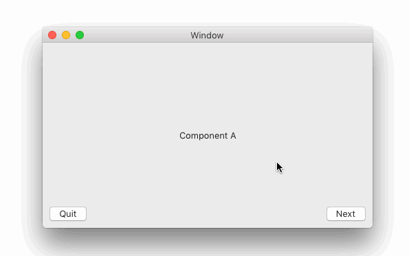
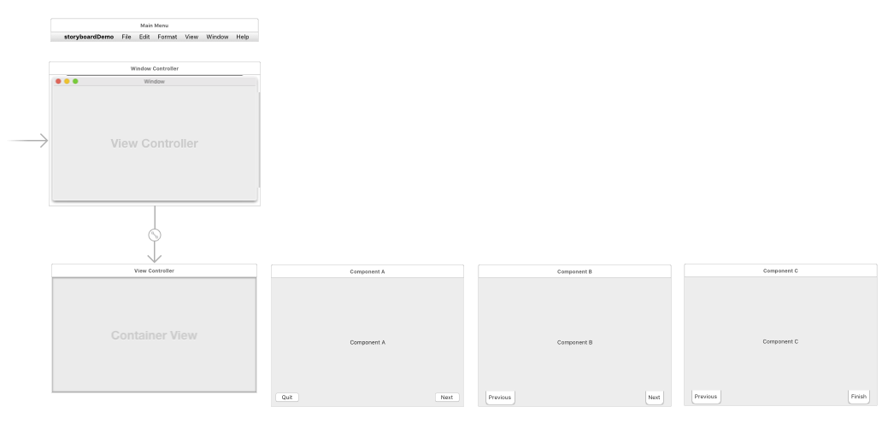

# OSX Wizard Storyboard Bootstrap
## Example of a storyboard with parent/child views

This is a quick sample of using storyboards with parent-child viewcontrollers - this particular sample is geared more towards a 'wizard' window, where I opted to have the navigation buttons be within the child views instead of the parent. 

The child viewcontrollers are lazy-loaded and is based on Mike Woelmer's iOS tutorial:
https://spin.atomicobject.com/2015/09/02/switch-container-views/

